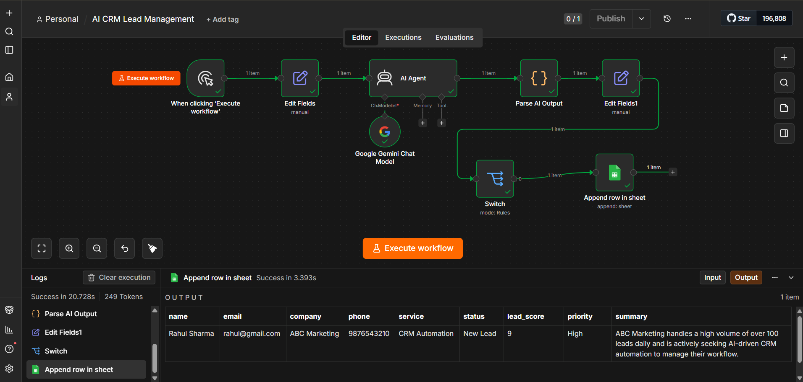

# 🤖 AI CRM Lead Management using n8n & Google Gemini

An AI-powered CRM automation workflow built using **n8n**, **Google Gemini AI**, and **Google Sheets**. The workflow automatically analyzes incoming leads, assigns an AI-generated lead score, classifies the lead priority, and stores qualified leads in a Google Sheets CRM.

---

## 📌 Overview

This project demonstrates how AI can automate the lead qualification process.

Instead of manually reviewing every lead, the workflow uses Google Gemini AI to analyze the lead details and generate:

- Lead Score
- Priority Level
- AI Summary

Qualified leads are then automatically stored in Google Sheets for further sales follow-up.

---

## 🚀 Workflow

```
Manual Trigger
      │
      ▼
Edit Fields
      │
      ▼
Google Gemini AI Agent
      │
      ▼
Parse AI Output
      │
      ▼
Edit Fields
      │
      ▼
Switch (Lead Score > 8)
      │
      ▼
Google Sheets CRM
```

---

## ⚙️ How It Works

### 1. Manual Trigger

Starts the workflow manually for testing.

---

### 2. Edit Fields

Simulates a customer inquiry by providing lead details such as:

- Name
- Email
- Company
- Phone
- Service
- Status

Example:

```
Name: Rahul Sharma
Company: ABC Marketing
Service: CRM Automation
```

---

### 3. Google Gemini AI

The AI analyzes the lead and returns:

- Lead Score
- Priority
- Business Summary

Example Response:

```json
{
  "lead_score": 9,
  "priority": "High",
  "summary": "ABC Marketing handles a high volume of leads and requires AI-powered CRM automation."
}
```

---

### 4. Parse AI Output

Converts the AI response into structured fields that can be used by downstream nodes.

Extracted fields:

- lead_score
- priority
- summary

---

### 5. Switch

Business logic:

```
IF Lead Score > 8

Store Lead

ELSE

Ignore
```

Only high-quality leads continue to the CRM.

---

### 6. Google Sheets

Stores qualified leads inside Google Sheets.

Saved fields include:

- Name
- Email
- Company
- Phone
- Service
- Status
- Lead Score
- Priority
- Summary

---

## 📊 Example Input

```json
{
  "name": "Rahul Sharma",
  "email": "rahul@gmail.com",
  "company": "ABC Marketing",
  "phone": "9876543210",
  "service": "CRM Automation",
  "status": "New Lead"
}
```

---

## 📈 Example Output

```json
{
  "lead_score": 9,
  "priority": "High",
  "summary": "ABC Marketing handles a high volume of leads and is actively seeking AI-driven CRM automation."
}
```

---

## 🛠 Technologies Used

- n8n
- Google Gemini AI
- Google Sheets
- JavaScript
- JSON

---

## 💼 Business Use Case

Businesses receive many inquiries every day.

Instead of manually reading each lead, this workflow:

- analyzes the inquiry using AI
- scores the lead automatically
- prioritizes important prospects
- stores qualified leads in a CRM

This reduces manual work and helps sales teams focus on high-value opportunities.

---

## 📸 Demo

### Workflow

_Add a screenshot of your n8n workflow here._

### Google Sheets Output

_Add a screenshot of your Google Sheets CRM here._

---

## 🔮 Future Improvements

- Webhook Integration
- Website Contact Form
- Email Notifications
- Slack Notifications
- CRM Integration (HubSpot / Salesforce)
- Dashboard using Looker Studio
- Multi-user Lead Assignment

---

## 👨‍💻 Author

**Manohar Payala**

AI Automation Developer

Building AI-powered workflow automation solutions using n8n and Generative AI.
## 📸 Workflow



---

## 📊 Google Sheets Output


